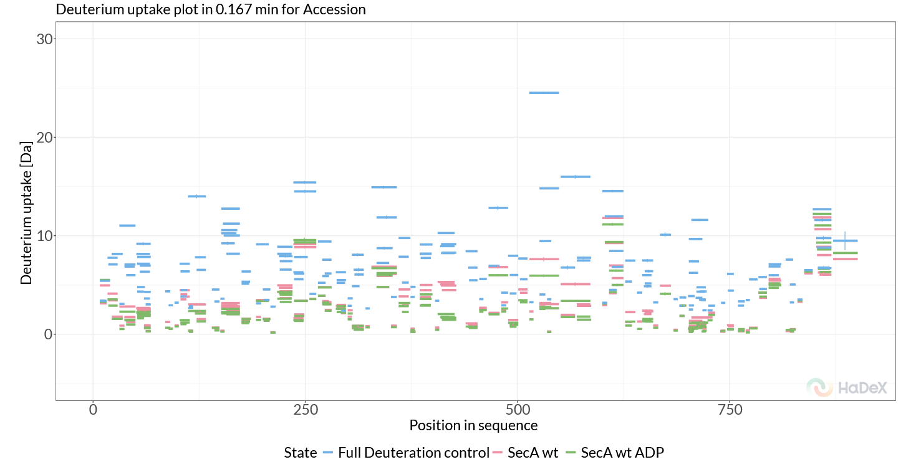
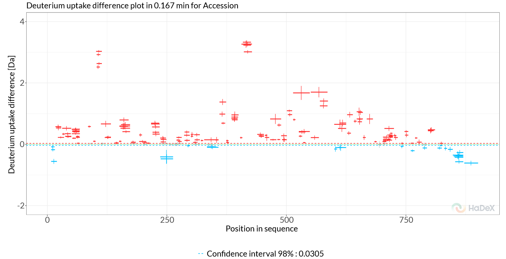
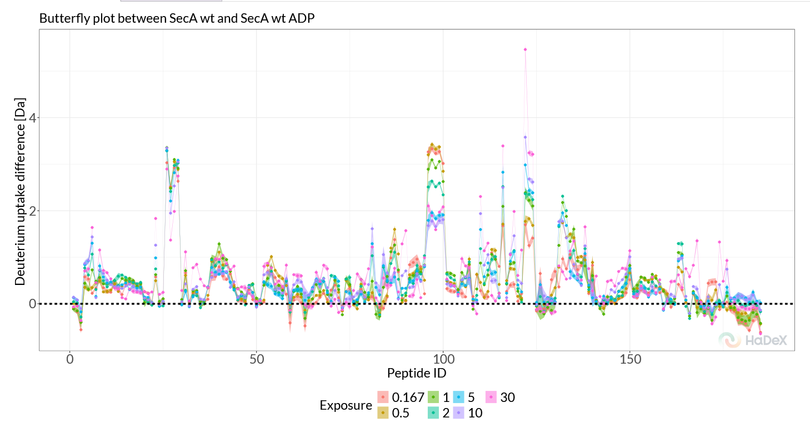
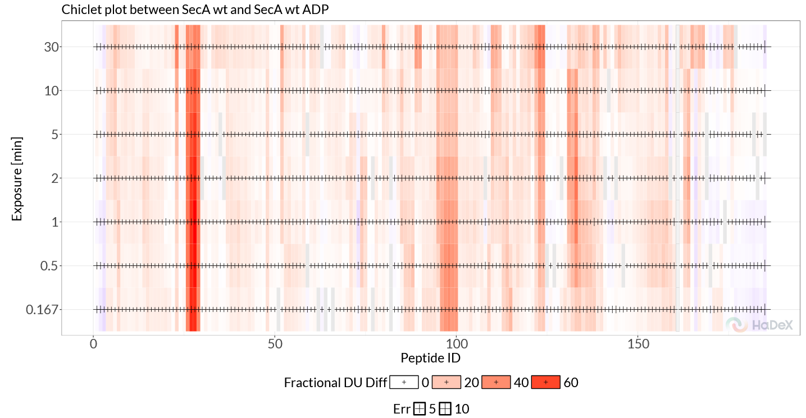
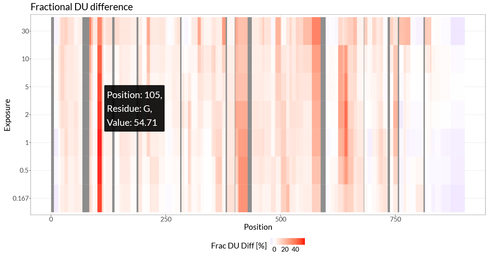
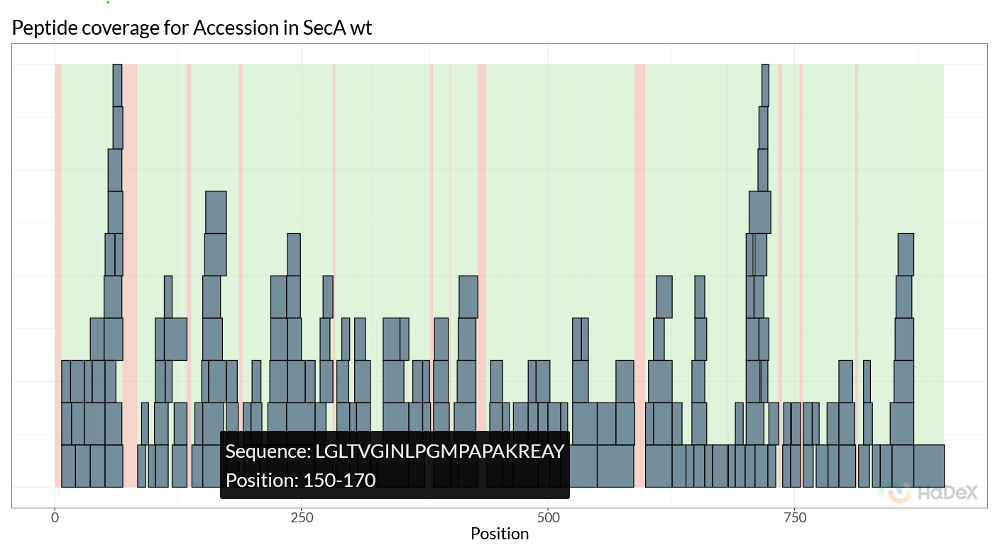

# Example HDX-MS data analysis

## 1 Introduction

This document summarizes functions of HaDeX2 web server by describing
example data analysis. The example dataset we will use here is part of a
previously published dataset on the SecA ATPase protein ([Krishnamurthy
et al. 2021](#ref-krishnamurthy_nexus_2021)). SecA is an essential part
of the bacterial Sec protein secretion system where it interacts with
secretory client proteins as well as its associated cytoplasmic
chaperones and is ultimately targeted to the SecYEG membrane channel
where it interacts with both non-folded clients as well as the export
channel, thereby regulating or powering protein export.

SecA is a DEAD motor domain ATPase, and in the cytoplasm the protein
predominantly exists as a dimeric, ADP bound ‘quiescent’ state. Only
through a series of interactions with the translocate and secretory
clients does SecA become fully activated and reaches the actively ATP
hydrolysing monomeric state, functioning as a molecular motor, driving
protein translocation.

## 2 Data analysis with HaDeX2

In the next sections we will take the SecA example data and stepwise run
it though the analysis pipeline of the HaDeX2 web server. In this
example we focus on SecA in its dimeric state, and we compare how
binding to ADP, switching the protein to its quiescent state, affects
the structural dynamics of SecA.

### 2.1 Input Data

The first step in our HDX-MS data analysis is to upload the data. In the
HaDeX2 webserver, in the ‘Input data’ tab, we can upload the data as
DynamX 3.0 ‘cluster’ files. Click ‘Browse’ to select the example data
file `inst/HaDeX/data/SecA_cluster_wt_ADP.csv`, after which the ‘File
status’ should report the file is valid and is of the DynamX3.0 format.
For this dataset, we also have a structure file available,
`inst/HaDeX/data/SecA_monomer.pdb` (modified from RCSB PDB entry 2VDA),
and it can be uploaded below in a similar fashion.

Next, we set the parameters for the analysis of this data. We select the
correct protein (‘Accession’), then choose which peptides correspond to
the Maximal exchange control (Accession \| Full Deuteration control \|
0.167). The `No deuterated` time point is set to 0.

### 2.2 Deuterium uptake

We can start by looking at deuterium uptake per peptide/time point. The
first plot generated is the Deuterium uptake plot (Figure
[2.1](#fig:uptake)). This shows replicate-averaged deuterium uptake
values per peptide, for all selected states, at a given time point. It
provides a good starting point to inspect the data, and verify no
peptide deuterium uptake exceeds the maximal uptake control uptake.

Figure 2.1: Deuterium uptake plot.

The second plot on this page is the Woods plot. This plot shows the
deuterium uptake difference between two selected states, in our case
this is a comparison between SecA dimer WT and SecA dimer + ADP. From
the generated figure (Figure [2.2](#fig:woods), we can immediately see
that two regions stand out, both part of the SecA nucleotide-binding
cleft, the first around 102-114 (Helicase motif I, NBD1) and the second
at 410-428 (NBD linker region). Deuterium uptake differences in these
regions are positive (red), indicating that these regions rigidify upon
ADP binding, and this rigidification allosterically propagates to SecA’s
client-binding clamp, thereby regulating its client interactions and
activity.

If we want to inspect these regions in more detail, we can use the
‘Ranges’ section in the sidebar to zoom the x range to the regions of
interest.

Next, to explore the data further, we can switch the plot to ‘Fractional
uptake’, where we use the maximal exchange control as reference. Select
the checkbox ‘Calculation \> Fractional values’ and then at ‘time
points’ make sure to select ‘chosen control’ for ‘Deut 100% Exposure’.
With these settings the Woods plot shows the differential HDX data in
terms of fractional deuterium uptake differences, removing the bias of
peptide length. Again, we see the same two regions stand out, and if we
explore more time points (‘time points \> Measurement Exposure \> 2’),
we find additional peptides which show rigidification, such as 570-587
(motif VI, NBD2) and 630-645 (scaffold domain).

Figure 2.2: Woods plot

The ‘Butterfly Differential plot’ provides a more comprehensive view of
all time points simultaneously. Switching to this view, we can more
easily track the evolution of deuterium uptake differences over time and
therefore all four regions of interest are clearly visible (Figure
[2.3](#fig:butterfly)). This view reviews another potentially rigidified
region, showing only at later timepoints, around the region 772-782.

Figure 2.3: Butterfly Differential plot.

The ‘Chiclet Plot’ provides a direct overview of the time-evolution of
differentially exchanged regions. Switching the plot to ‘Fractional
Values’, we can see that two regions (102-114, 410-428) are present
independent of the time point, while the differences in 570-587 increase
over time, and the 630-645 regions shows a ‘appear-disappear’ behavior,
being most prominent at intermediate time points (Figure
[2.4](#fig:chiclet)).

Figure 2.4: Chiclet Plot.

To zoom in on this phenomenon, we can view the uptake curve of a single
peptide using the ‘Uptake Curves Plot / Differential Plot’. A single
peptide can be selected in the “Peptide” section of the sidebar. Filter
for sequence ‘AIANAQRKVE’, and choose this particular peptide from the
filtered table. Now, we can confirm that indeed for this peptide, SecA
WT initially takes up deuterium faster compared to SecA bound to ADP,
but at later time points the curves converge. The ‘Differential Plot’
directly shows the differences as a rise and decay.

### 2.3 Time-based data

The ‘Time-based data’ tab provides more information on replicates and
statistical significance between states. The ‘Replicates’ view gives a
quick overview of the replicates for each state and time point. For
example, the second plot on this page shows directly that for the
non-deuterated control (0s), there are a couple of peptides where one or
more replicates are missing. We can use this information to quickly
identify peptides which might need to be excluded or we need to collect
additional data. The Manhattan plot provides similar information the
Woods plot, but instead of reporting on deuterium uptake differences, it
shows the statistical significance of these differences. This can be an
important tool when judging how to interpret deuterium uptake
differences between peptides. In our example data, the Manhattan plot
shows that generally we have obtained a lot of peptide with
statistically significant differences, where regions with low or no
differences in D-uptake also show low statistical significance. Finally,
in the uncertainty plot we can see the calculated standard error of the
mean for the replicates to indicate regions of higher measurement
uncertainty for optional double-check, part of quality control.

### 2.4 Hi-res + 3D

Because we have provided a structural model alongside our peptide data,
HaDeX2 allows us to directly visualize residue-level data mapped onto
the structure. To achieve this, we can use ‘Differential Heatmap + 3D
Vis’. Again, we use ‘Fractional values’, and set ‘Deut 100% Exposure’ to
‘chosen control’. The generated heatmap (Figure
[2.5](#fig:differential-heatmap)) shows the same regions of interest,
with as critical difference that now instead of looking at
peptide-level, the data has been mapped to individual residues by
weighted averaging.

Figure 2.5: Differential hcheatmap.

In the differential heatmap, we can now see our regions of interest with
residue-level resolution. The two main regions, 102-114 and 410-428, are
clearly visible, as well as the more subtle differences in 570-587 and
630-645. The region around 772-782 is less clear in this view, likely
because this region is only subtly affected and only at later time
points.

The 3D viewer provides an interactive way to explore these differences
in the context of the protein structure. By mapping the differential HDX
data onto the 3D structure of SecA, we can directly see how ADP binding
rigidifies specific regions of the protein (Figure
[2.6](#fig:differential-structure)). In this figure, we can clearly see
the strongest response in helicase motif I, rigidifying upon ADP
binding, as well as the allosteric propagation of this effect through
the scaffold regions ultimately resulting in a long-range allosteric
response in the client-binding PPD domain.

For more control over the visualization colors and plot ranges, the
residue-level data can be exported in a .csv format and subsequently
visualized by HDX-Viewer ([Bouyssié et al.
2019](#ref-bouyssie_hdx-viewer_2019)). When exporting the data to
HDX-Viewer, click the ‘Export data for HDXViewer’ and follow the steps
described in the popup window.

Figure 2.6: 3D view of differential HDX data on the structure of SecA.

### 2.5 Measurements

The ‘Measurements’ tab allows us to further inspect the individual
replicate measurement results. This tab provides a per-peptide view
where we can use the peptide table in the sidebar to select peptides of
interest. Then, for the selected exposure time, we can now inspect each
replicate measurement, see how they are distributed and we see which
charged states were used and how they compare. The second graphs shows
this information for all time points as a peptide uptake curve.

### 2.6 Sequence data

The ‘Sequence data’ tab can be used to reconstruct the sequence from the
uploaded data and shows the coverage and sequence length. This can be
used as a quick sanity check to confirm the correct sequence information
was used. This tab also provides peptide coverage plots. The ‘Coverage’
graph (Figure [2.7](#fig:coverage)) gives a quick overview of which
peptides were identified, and which regions have no coverage. The
‘Position Frequency’ graph on this page shows for each residue how many
peptides cover this region, providing information on peptide redundancy.

Figure 2.7: Peptide coverage for SecA WT.

### 2.7 Summary

The summary is a very convenient and quick way to generate a summary
report of the uploaded data, according to community recommendations
([Masson et al. 2019](#ref-masson_recommendations_2019)). The report can
be exported in a variety of tabular formats.

Bouyssié, David, Jean Lesne, Marie Locard-Paulet, Renaud Albigot, Odile
Burlet-Schiltz, and Julien Marcoux. 2019. “HDX-Viewer: Interactive 3D
Visualization of Hydrogen–Deuterium Exchange Data.” *Bioinformatics* 35
(24): 5331–33. <https://doi.org/10.1093/bioinformatics/btz550>.

Krishnamurthy, Srinath, Nikolaos Eleftheriadis, Konstantina Karathanou,
Jochem H. Smit, Athina G. Portaliou, Katerina E. Chatzi, Spyridoula
Karamanou, Ana-Nicoleta Bondar, Giorgos Gouridis, and Anastassios
Economou. 2021. “A Nexus of Intrinsic Dynamics Underlies Translocase
Priming.” *Structure* 29 (8): 846–858.e7.
<https://doi.org/10.1016/j.str.2021.03.015>.

Masson, Glenn R., John E. Burke, Natalie G. Ahn, Ganesh S. Anand,
Christoph Borchers, Sébastien Brier, George M. Bou-Assaf, et al. 2019.
“Recommendations for Performing, Interpreting and Reporting Hydrogen
Deuterium Exchange Mass Spectrometry (HDX-MS) Experiments.” *Nature
Methods* 16 (7): 595–602. <https://doi.org/10.1038/s41592-019-0459-y>.
