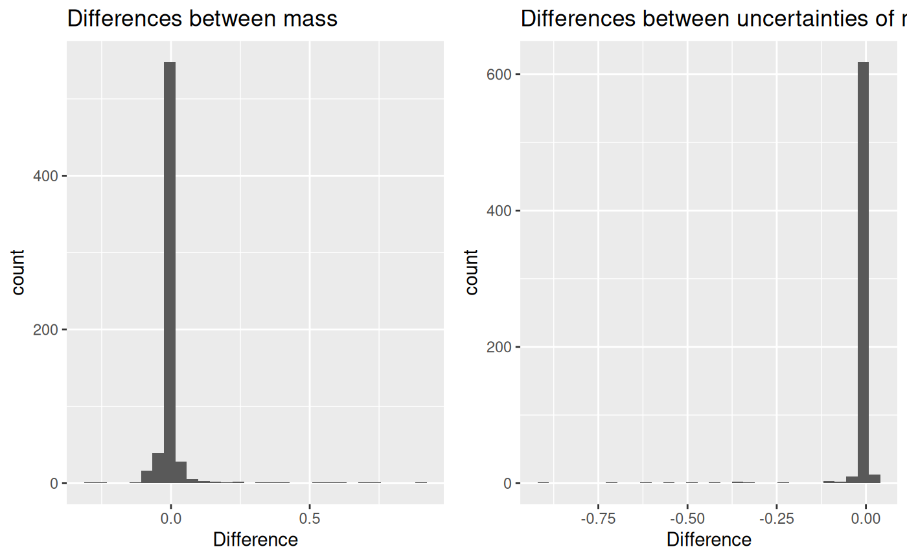

# Mass calculation

## 0.1 Comparison of results with weighted mean and without

As it is described in
[`vignette("datafiles")`](https://hadexversum.github.io/HaDeX2/articles/datafiles.md)
article, the data within each replicate of the experiment is aggregated
using weighted mean. Below we present the effect it has on the results.

The whole workflow is described in the mentioned article. Here the focus
is on the first aspect of the processing.

For the analysis, we use the example file from HaDeX in its raw form,
directly exported from DynamX:

``` r
library(HaDeX2)
head(alpha_dat)
```

    ##      Protein Start   End    Sequence Modification MaxUptake   MHP       State
    ##       <char> <int> <int>      <char>       <lgcl>     <int> <num>      <char>
    ## 1: db_eEF1Ba     1    11 GFGDLKSPAGL           NA         9  1062 ALPHA_Gamma
    ## 2: db_eEF1Ba     1    11 GFGDLKSPAGL           NA         9  1062 ALPHA_Gamma
    ## 3: db_eEF1Ba     1    11 GFGDLKSPAGL           NA         9  1062 ALPHA_Gamma
    ## 4: db_eEF1Ba     1    11 GFGDLKSPAGL           NA         9  1062 ALPHA_Gamma
    ## 5: db_eEF1Ba     1    11 GFGDLKSPAGL           NA         9  1062 ALPHA_Gamma
    ## 6: db_eEF1Ba     1    11 GFGDLKSPAGL           NA         9  1062 ALPHA_Gamma
    ##    Exposure                              File     z  Inten Center
    ##       <num>                            <char> <int>  <int>  <num>
    ## 1:    0.000 Tania_161112_eEF1Ba_KSCN_IMS_seq1     1 138844   1062
    ## 2:    0.000 Tania_161112_eEF1Ba_KSCN_IMS_seq1     2 728218    532
    ## 3:    0.167  Tania_161109_1eEF1Bag_KSCN_10sec     1  41100   1064
    ## 4:    0.167  Tania_161109_1eEF1Bag_KSCN_10sec     2 393115    532
    ## 5:    0.167  Tania_161109_2eEF1Bag_KSCN_10sec     1  46642   1064
    ## 6:    0.167  Tania_161109_2eEF1Bag_KSCN_10sec     2 466233    532

As described, the first step is to transform the \\Center\\ value
(geometric centroid of the isotopic envelope for given peptide in a
given state in given time point) and then to aggregate the values
measured for different charge values. This is all done within each
replicate.

The aggregation in our workflow is a weighted mean, with \\Inten\\
(intensity) values as weights, as shown below.

``` r
avg_exp_mass = weighted.mean(exp_mass, Inten, na.rm = TRUE)
```

Later, the results from replicates are aggregated using the mean, and
their uncertainty is calculated as the standard deviation of the mean.

How the weighted mean change the result in comparison with the simple
mean? Let’s see.

Below are calculated values of mass in two approaches and the difference
between them for the example peptide.

    ##       Sequence Start End            State Exposure no_weight weight     diff
    ## 1  GFGDLKSPAGL     1  11 ALPHA_beta_gamma    0.000      1061   1061  0.05177
    ## 2  GFGDLKSPAGL     1  11 ALPHA_beta_gamma    0.167      1063   1063 -0.01077
    ## 3  GFGDLKSPAGL     1  11 ALPHA_beta_gamma    1.000      1064   1064  0.05887
    ## 4  GFGDLKSPAGL     1  11 ALPHA_beta_gamma    5.000      1065   1065 -0.02870
    ## 5  GFGDLKSPAGL     1  11 ALPHA_beta_gamma   25.000      1066   1065 -0.06059
    ## 6  GFGDLKSPAGL     1  11 ALPHA_beta_gamma  150.000      1067   1067 -0.00799
    ## 7  GFGDLKSPAGL     1  11 ALPHA_beta_gamma 1440.000      1067   1067 -0.00972
    ## 8  GFGDLKSPAGL     1  11      ALPHA_Gamma    0.000      1061   1061  0.05177
    ## 9  GFGDLKSPAGL     1  11      ALPHA_Gamma    0.167      1063   1063  0.00815
    ## 10 GFGDLKSPAGL     1  11      ALPHA_Gamma    1.000      1064   1064 -0.02300
    ## 11 GFGDLKSPAGL     1  11      ALPHA_Gamma    5.000      1065   1065 -0.01824
    ## 12 GFGDLKSPAGL     1  11      ALPHA_Gamma   25.000      1066   1066  0.05352
    ## 13 GFGDLKSPAGL     1  11      ALPHA_Gamma  150.000      1067   1067  0.00465
    ## 14 GFGDLKSPAGL     1  11      ALPHA_Gamma 1440.000      1067   1067  0.00125
    ## 15 GFGDLKSPAGL     1  11       Alpha_KSCN    0.000      1061   1061  0.05177
    ## 16 GFGDLKSPAGL     1  11       Alpha_KSCN    0.167      1063   1063  0.02166
    ## 17 GFGDLKSPAGL     1  11       Alpha_KSCN    1.000      1064   1064  0.01387
    ## 18 GFGDLKSPAGL     1  11       Alpha_KSCN    5.000      1065   1065  0.00814
    ## 19 GFGDLKSPAGL     1  11       Alpha_KSCN   25.000      1066   1066 -0.04272
    ## 20 GFGDLKSPAGL     1  11       Alpha_KSCN  150.000      1067   1067 -0.05001
    ## 21 GFGDLKSPAGL     1  11       Alpha_KSCN 1440.000      1067   1067  0.00125

Below are calculated values of the uncertainty of mass in two approaches
and the difference between them for the example peptide.

    ##       Sequence Start End            State Exposure no_weight  weight      diff
    ## 1  GFGDLKSPAGL     1  11 ALPHA_beta_gamma    0.000    0.0000 0.00000  0.000000
    ## 2  GFGDLKSPAGL     1  11 ALPHA_beta_gamma    0.167    0.0423 0.02054 -0.021812
    ## 3  GFGDLKSPAGL     1  11 ALPHA_beta_gamma    1.000    0.0650 0.01736 -0.047644
    ## 4  GFGDLKSPAGL     1  11 ALPHA_beta_gamma    5.000    0.0000 0.00000  0.000000
    ## 5  GFGDLKSPAGL     1  11 ALPHA_beta_gamma   25.000    0.0556 0.07851  0.022930
    ## 6  GFGDLKSPAGL     1  11 ALPHA_beta_gamma  150.000    0.0173 0.04958  0.032235
    ## 7  GFGDLKSPAGL     1  11 ALPHA_beta_gamma 1440.000    0.0150 0.03998  0.024979
    ## 8  GFGDLKSPAGL     1  11      ALPHA_Gamma    0.000    0.0000 0.00000  0.000000
    ## 9  GFGDLKSPAGL     1  11      ALPHA_Gamma    0.167    0.0144 0.00306 -0.011390
    ## 10 GFGDLKSPAGL     1  11      ALPHA_Gamma    1.000    0.0622 0.03507 -0.027156
    ## 11 GFGDLKSPAGL     1  11      ALPHA_Gamma    5.000    0.0529 0.05732  0.004453
    ## 12 GFGDLKSPAGL     1  11      ALPHA_Gamma   25.000    0.0763 0.07242 -0.003861
    ## 13 GFGDLKSPAGL     1  11      ALPHA_Gamma  150.000    0.0680 0.08054  0.012560
    ## 14 GFGDLKSPAGL     1  11      ALPHA_Gamma 1440.000    0.0124 0.03798  0.025605
    ## 15 GFGDLKSPAGL     1  11       Alpha_KSCN    0.000    0.0000 0.00000  0.000000
    ## 16 GFGDLKSPAGL     1  11       Alpha_KSCN    0.167    0.0634 0.06314 -0.000299
    ## 17 GFGDLKSPAGL     1  11       Alpha_KSCN    1.000    0.0324 0.05766  0.025239
    ## 18 GFGDLKSPAGL     1  11       Alpha_KSCN    5.000    0.0430 0.04451  0.001488
    ## 19 GFGDLKSPAGL     1  11       Alpha_KSCN   25.000    0.0691 0.02714 -0.041996
    ## 20 GFGDLKSPAGL     1  11       Alpha_KSCN  150.000    0.0231 0.01416 -0.008909
    ## 21 GFGDLKSPAGL     1  11       Alpha_KSCN 1440.000    0.0124 0.03798  0.025605

And for the whole set of peptides, the average mass difference is:

    ## [1] 0.0135

and uncertainty difference is:

    ## [1] -0.00875

Below are the histograms of these differences.


