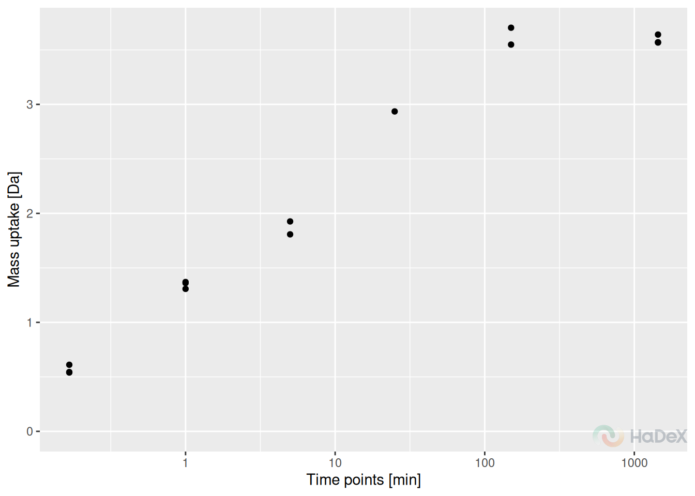

# Quality control

``` r
library(HaDeX2)
```

Data analysis is vital step, but firstly, we must make sure that the
experiment was conducted correctly. How to do that using HaDeX
functionalities? There are multiple ways to do that. Unfortunately, our
example data is good quality, but we will discuss possible indicators of
data that needs to be re-checked.

## Replicates

Firstly, we check the number of replicates. Although the experiment is
conducted in known number of times, sometimes during the manual curation
of isotopic envelopes, some of the spectras are disqualified. Here, we
check the remaining number of replicates of the already curated dataset.

It is advised to have at least three replicates of the experiment.
Lesser number limits the statistical analysis - e.q. for calculating
P-value using T-student test minimum of three replicates are needed. If
there are only two replicates, the uncertainty can be calculated.

In the example plot below, we see that there are three peptides in this
state that are lacking values. One peptide - with considerably lack of
replicates potentially should be eliminated from the peptide pool.
Majority of peptides have a stable number of replicates - in this case
three, with exception of no-deuterated control sample, measured only
once.

``` r
rep_dat <- create_replicate_dataset(alpha_dat)
plot_replicate_histogram(rep_dat)
```


## Uncertainty

Uncertainty plot presents the uncertainty of the measurement for one
state at the time. In this case, we present the time points separately.
There is no uncertainty calculated for time point 0 min, as it is
treated as undeuterated control and measured only once. For other time
points, as the measurement was conducted in triplicate, there are values
for measured mass. As the measured mass is in daltons, also the
uncertainty is presented in daltons. Thus, we can establish a threshold
of 1 dalton - indicating one exchange between proton and deuter. Any
uncertainty exceeding - or coming close - to this threshold should be
carefully checked.

For correctly conducted experiment, the uncertainty for all peptides in
all time points should be close to 0.

In the example below, all measurement have acceptable level of
uncertainty. Of course, those values differ depending on the region or
peptide length, but overall are not exceeding 0.25 Da.

``` r
plot_uncertainty(alpha_dat, state = "Alpha_KSCN")
```


## Measurements

Once we have the overview of the situation, we can dig deeper into the
peptides of interest.

Below, we present the measurement variability plot for peptide
“GDGDLKSPAGL” in one state, for three replicates.The process of two-step
aggregation is described in the article `transformation`, but this plot
allows investigation of each measurement.

Here, in case of peptide “GDGDLKSPAGL”, there were only two possible
charge values: 1 and 2. The mass was measured for each of them
separately, and the centroid value from isotopic envelope was
calculated, as well as the appropriate intensity. On the Y axis of the
plot, there are replicates: and each replicate has its two points for
each charge - with colors indicating charge and size indicating
intensity. Then, those two values within replicate are aggregated - as a
weighted mean, with intensity being the weight. For each replicate we
have now one value - black dot. Those values are averaged with
accompanied standard deviation - our final aggregated mass measurement
from all the replicates. The final value is shown as the horizontal
dotted line, with its sd value indicated by the red area.

``` r
plot_peptide_mass_measurement(alpha_dat)
```


The peptide recognized as under-measured using previous plot, is peptide
“CVRSIQA” in state eEF1B$\gamma$. We analyze the mass uptake with
regards to replicates (aggregated charge) and we see that for time point
25 min only one measurement was accepted, and for other time points two,
thus blocking the possibility of calculating statistical significance
when using this peptide in comparative analysis.

``` r
plot_replicate_mass_uptake(alpha_dat, sequence = "CVRSIQA", aggregated = TRUE)
```



## Back-exchange

Important measure of quality of experiment is back-exchange. Usually,
expected value of back-exchange should be around 30%, possibly higher
for shorter peptides.

``` r
bex_dat <- calculate_back_exchange(alpha_dat, state = "Alpha_KSCN")
plot_coverage_heatmap(bex_dat, value = "back_exchange")
#> Ignoring unknown labels:
#> • colour : "Exposure"
```


