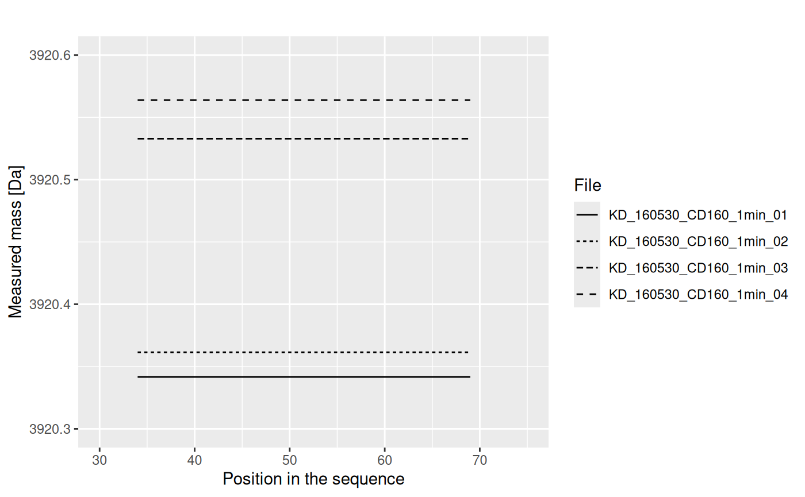
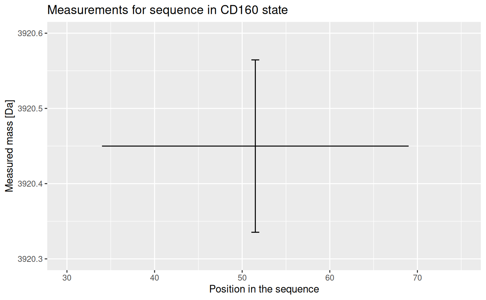

# Data aggregation

The aggregation of the hydrogen-deuterium exchange experimental data is
complex. This article describes the process step by step for a better
understanding of the data transformation.

## 0.1 Aggregation of the data - visualization

Let’s see how the data is transformed. We will use the example alpha_dat
file from the HaDeX package and focus on just one peptide -
“GFGDLKSPAGL” in the state “Alpha”. The measurement was made for time
point 1 min.

Below is shown the original and not aggregated data for chosen peptide.

    ##      Protein Start   End    Sequence Modification MaxUptake      MHP      State
    ##       <char> <int> <int>      <char>       <lgcl>     <int>    <num>     <char>
    ## 1: db_eEF1Ba     1    11 GFGDLKSPAGL           NA         9 1061.563 Alpha_KSCN
    ## 2: db_eEF1Ba     1    11 GFGDLKSPAGL           NA         9 1061.563 Alpha_KSCN
    ## 3: db_eEF1Ba     1    11 GFGDLKSPAGL           NA         9 1061.563 Alpha_KSCN
    ## 4: db_eEF1Ba     1    11 GFGDLKSPAGL           NA         9 1061.563 Alpha_KSCN
    ## 5: db_eEF1Ba     1    11 GFGDLKSPAGL           NA         9 1061.563 Alpha_KSCN
    ## 6: db_eEF1Ba     1    11 GFGDLKSPAGL           NA         9 1061.563 Alpha_KSCN
    ##    Exposure                           File     z  Inten    Center
    ##       <num>                         <char> <int>  <int>     <num>
    ## 1:        1 Tania_161108_1eEF1Ba_KSCN_1min     1  48304 1064.9813
    ## 2:        1 Tania_161108_1eEF1Ba_KSCN_1min     2 430554  533.0463
    ## 3:        1 Tania_161108_2eEF1Ba_KSCN_1min     1  48450 1065.1294
    ## 4:        1 Tania_161108_2eEF1Ba_KSCN_1min     2 456787  532.9971
    ## 5:        1 Tania_161108_3eEF1Ba_KSCN_1min     1  53200 1065.0681
    ## 6:        1 Tania_161108_3eEF1Ba_KSCN_1min     2 469153  533.1101

As we can see from the \\File\\ column, there are four replicates of the
experiment. Each measurement of a replicate provide values for different
possible charge values for each peptide. The result of a measurement is
in column \\Center\\ - this is a geometrical centroid of an isotopic
envelope - the product of the measurement from a mass spectrometer.

Let’s take a look for values for each replicate.

The centroid values for different charge values are not useful. We have
to transform it to the mass values, according to an equation:

\\ aggMass = z\*(Center - protonMass)\\ The results are shown below.

This results are just for one repetition. We have four of them:

Values from each replicate are aggregated into one value, using weighted
mean (with intensity value as weight):

The results from replicates are aggregated into the final result (mean),
and the uncertainty (standard deviation of the mean) is calculated.

Now we have the mass value for chosen peptide in the chosen state,
measured in the chosen time point. This calculation is done for every
other peptide, and these values of mass and uncertainty are used in the
calculation of deuterium uptake, as described in the
[`vignette("datafiles")`](https://hadexversum.github.io/HaDeX2/articles/datafiles.md)
article.
