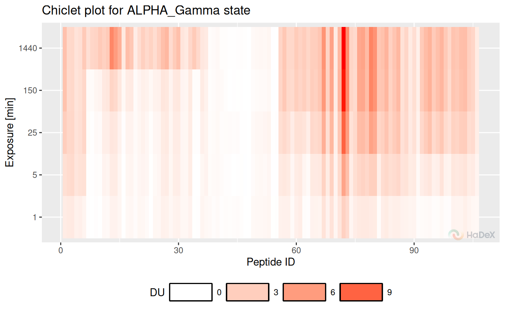

# Code usage

## Convention

Purpose of groups of functions in the package:

- calculate\_\* - calculates one specific value. e.q. deuterium uptake
  values for specific time point.
- create\_\* - creates a dataset for set of values e.q. multiple time
  points.
- plot\_\* - plots a visualization of provided data, accepts
  calculate\_\* and create\_\* outputs.
- show\_\* - subsets the dataset to show specific values, accepts
  calculate\_\* and create\_\* outputs.

Variables:

- deut_uptake - deuterium uptake \[Da\]
- frac_deut_uptake - fractional deuterium uptake \[%\]
- theo_deut_uptake - theoretical deuterium uptake \[Da\]
- theo_frac_deut_uptake - theoretical fractional deuterium uptake \[%\]
- diff_deut_uptake - differential deuterium uptake \[Da\]
- frac_diff_deut_uptake - theoretical differential fractional deuterium
  uptake \[%\]
- theo_diff_deut_uptake - differential deuterium uptake \[Da\]
- theo_frac_diff_deut_uptake - theoretical differential fractional
  deuterium uptake \[%\]

## Example of use

### Read data file

``` r
dat <- read_hdx(system.file(package = "HaDeX2", "HaDeX/data/alpha.csv"))
```

### Different forms of visualization

Create data frame with uptake values for state in all time points:

``` r
uptake_dat <- create_state_uptake_dataset(dat)
```

Butterfly:

``` r
plot_butterfly(uptake_dat)
```


Chiclet:

``` r
plot_chiclet(uptake_dat)
```

    ## Warning: The `size` argument of `element_rect()` is deprecated as of ggplot2 3.4.0.
    ## ℹ Please use the `linewidth` argument instead.
    ## ℹ The deprecated feature was likely used in the HaDeX2 package.
    ##   Please report the issue to the authors.
    ## This warning is displayed once per session.
    ## Call `lifecycle::last_lifecycle_warnings()` to see where this warning was
    ## generated.


