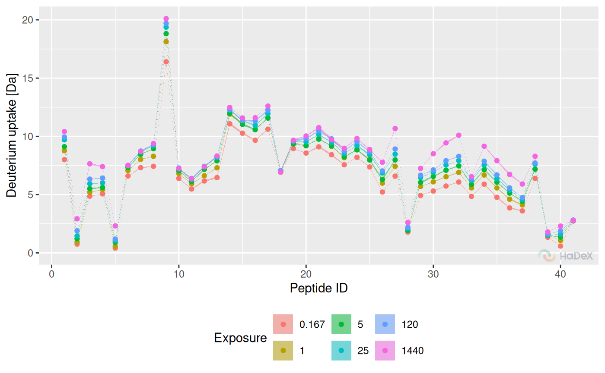

# Code usage

## Convention

Purpose of groups of functions in the package:

- calculate\_\* - calculates one specific value. e.q. deuterium uptake
  values for specific time point.
- create\_\* - creates a dataset for set of values e.q. multiple time
  points.
- plot\_\* - plots a visualization of provided data, accepts
  calculate\_\* and create\_\* outputs.
- show\_\* - subsets the dataset to show specific values, accepts
  calculate\_\* and create\_\* outputs.

Variables:

- deut_uptake - deuterium uptake \[Da\]
- frac_deut_uptake - fractional deuterium uptake \[%\]
- theo_deut_uptake - theoretical deuterium uptake \[Da\]
- theo_frac_deut_uptake - theoretical fractional deuterium uptake \[%\]
- diff_deut_uptake - differential deuterium uptake \[Da\]
- frac_diff_deut_uptake - theoretical differential fractional deuterium
  uptake \[%\]
- theo_diff_deut_uptake - differential deuterium uptake \[Da\]
- theo_frac_diff_deut_uptake - theoretical differential fractional
  deuterium uptake \[%\]

## Example of use

### Read data file

``` r
dat <- read_hdx(system.file(package = "HaDeX", "HaDeX/data/KD_180110_CD160_HVEM.csv"))
```

``` r
# dat %>%
#   calculate_state_uptake() %>%
#   plot_state_comparison()
```

``` r
dat %>%
  calculate_peptide_kinetics(protein = "db_CD160",
                             sequence = "INITSSASQEGTRLN",
                             start = 1,
                             end = 15,
                             states = c("CD160", "CD160_HVEM"),
                             time_0 = 0.001, time_100 = 1440) %>%
  plot_uptake_curve(fractional = TRUE)
```

    ## Warning in log(x, base): NaNs produced


``` r
dat %>%
  calculate_peptide_kinetics(protein = "db_CD160",
                             sequence = "INITSSASQEGTRLN",
                             start = 1,
                             end = 15,
                             states = c("CD160", "CD160_HVEM"),
                             time_0 = 0.001, time_100 = 1440) %>%
  show_uptake_data(fractional = TRUE)
```

    ##      Protein        Sequence    ID Modification      State Start   End Exposure
    ##       <char>          <char> <int>       <lgcl>     <char> <int> <int>    <num>
    ##  1: db_CD160 INITSSASQEGTRLN     1           NA      CD160     1    15    0.167
    ##  2: db_CD160 INITSSASQEGTRLN     1           NA      CD160     1    15    1.000
    ##  3: db_CD160 INITSSASQEGTRLN     1           NA      CD160     1    15    5.000
    ##  4: db_CD160 INITSSASQEGTRLN     1           NA      CD160     1    15   25.000
    ##  5: db_CD160 INITSSASQEGTRLN     1           NA      CD160     1    15  120.000
    ##  6: db_CD160 INITSSASQEGTRLN     1           NA CD160_HVEM     1    15    0.167
    ##  7: db_CD160 INITSSASQEGTRLN     1           NA CD160_HVEM     1    15    1.000
    ##  8: db_CD160 INITSSASQEGTRLN     1           NA CD160_HVEM     1    15    5.000
    ##  9: db_CD160 INITSSASQEGTRLN     1           NA CD160_HVEM     1    15   25.000
    ## 10: db_CD160 INITSSASQEGTRLN     1           NA CD160_HVEM     1    15  120.000
    ##     Frac DU [%] U(Frac DU) [%]
    ##           <num>          <num>
    ##  1:     76.8561         0.3832
    ##  2:     84.1962         0.6111
    ##  3:     87.5333         0.5943
    ##  4:     93.1959         0.5786
    ##  5:     95.5038         0.8333
    ##  6:     74.3584         0.6689
    ##  7:     81.5377         0.9895
    ##  8:     82.8900         0.8820
    ##  9:     87.6782         0.7086
    ## 10:     95.1868         0.7919

### Different forms of visualization

Create data frame with uptake values for state in all time points:

``` r
uptake_dat <- create_state_uptake_dataset(dat)
```

Butterfly:

``` r
plot_butterfly(uptake_dat)
```

    ## Warning: Using `size` aesthetic for lines was deprecated in ggplot2 3.4.0.
    ## ℹ Please use `linewidth` instead.
    ## ℹ The deprecated feature was likely used in the HaDeX2 package.
    ##   Please report the issue to the authors.
    ## This warning is displayed once every 8 hours.
    ## Call `lifecycle::last_lifecycle_warnings()` to see where this warning was
    ## generated.



Chiclet:

``` r
plot_chiclet(uptake_dat)
```

    ## Warning: The `size` argument of `element_rect()` is deprecated as of ggplot2 3.4.0.
    ## ℹ Please use the `linewidth` argument instead.
    ## ℹ The deprecated feature was likely used in the HaDeX2 package.
    ##   Please report the issue to the authors.
    ## This warning is displayed once every 8 hours.
    ## Call `lifecycle::last_lifecycle_warnings()` to see where this warning was
    ## generated.


