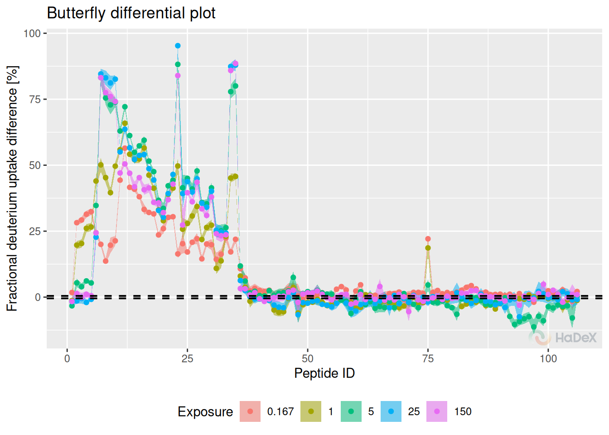
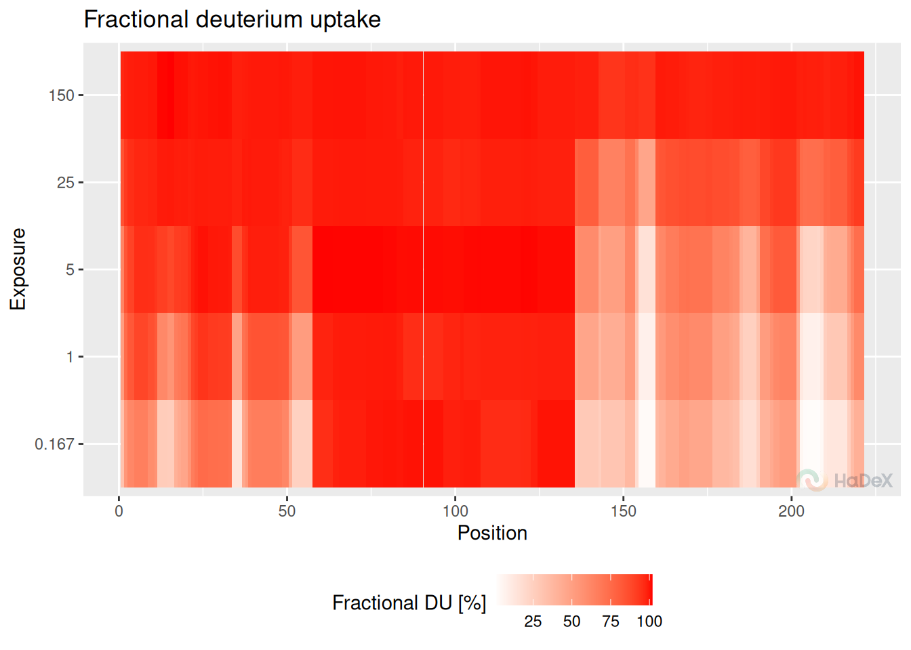

# Data visualization

Data visualization is a crucial part of the experimental data analysis.
The forms of visualization should be adjusted to highlight the essential
result and tailored to satisfy personal needs.

In this article, we present methods of data visualization available in
the HaDeX2 package, and consecutively in the GUI.

The analyzed protein is the eEF1Bα subunit of the human
guanine-nucleotide exchange factor (GEF) complex (eEF1B), measured in
[Mass Spectrometry Lab](https://mslab-ibb.pl/) in [Institute of
Biochemistry and Biophysics Polish Academy of
Sciences](https://ibb.edu.pl/en/) and published by [Bondarchuk et
al](https://doi.org/10.1093/nar/gkac685). In the one-state
classification, we will focus on pure alpha state - eEF1B$\alpha$. The
comparative analysis is conducted between eEF1B$\alpha$ and
eEF1B$\alpha$ in presence of eEF1B$\gamma$.

## Comparison plot

The comparison plot presents deuterium uptake of the peptides in a given
time point, with information on the length of the peptide and their
position in the protein sequence. It allows comparison of the results of
different biological states.

**Example** In the comparison plot below, we see the fractional
deuterium uptake for all three possible states: eEF1B$\alpha$,
eEF1B$\alpha$ in presence of eEF1B$\gamma$ and in presence of
eEF1B$\beta$, from protein eEF1B. The values are calculated for the time
point 1 min. The length of the segments represents the length of the
peptide and the position in the protein sequence. The error bars
indicate the uncertainty of the measurement.

    ## Warning: Using `size` aesthetic for lines was deprecated in ggplot2 3.4.0.
    ## ℹ Please use `linewidth` instead.
    ## ℹ The deprecated feature was likely used in the HaDeX2 package.
    ##   Please report the issue to the authors.
    ## This warning is displayed once every 8 hours.
    ## Call `lifecycle::last_lifecycle_warnings()` to see where this warning was
    ## generated.

*Pros:*

- peptide length and position
- comparison of multiple biological states
- region with difference is easy to spot on
- uncertainty for each peptide

*Plot variants:*

- fractional/absolute values
- fractional values calculated with respect of theoretical/experimental
  maximal uptake
- plots with different time points can be plotted next to each other
- tooltips available in GUI

## Woods plot

Woods plot presents the deuterium uptake difference between two
biological states for the peptides. The results are presented with
respect to the length of the peptide and its position in the protein
sequence for a given time point of the measurement. The statistical test
(Houde et al., the confidence level is calculated based on the
measurements in chosen time point of the measurement) is applied to
determine the confidence limits values at the chosen level.

**Example** On the Woods plot below, we see fractional deuterium uptake
difference between two biological states eEF1B$\alpha$ and eEF1B$\alpha$
in presence of eEF1B$\gamma$ for protein eEF1B The confidence limits
indicate which differences are statistically significant at levels 98%.

*Pros:*

- differential analysis between two states
- peptide length and position
- region with difference is easy to spot on
- uncertainty for each peptide
- hybrid statistical testing
- statistical level

*Plot variables:*

- fractional/absolute values
- fractional values calculated with respect of theoretical/experimental
  maximal uptake
- plots with different time points can be plotted next to each other
- peptides classified as statistically insignificant can be hidden
- tooltips available in GUI

## Butterfly plot

Butterfly plot presents the deuterium uptake for all peptides in a given
state at different time points at once. Each time point of measurement
is indicated by a different color. Peptides are identified by their ID
(peptides are numbered arranged by the start position).

**Example** Below, on the butterfly plot, we see how the deuterium
uptake changes in time for state eEF1B$\alpha$ for protein eEF1B. We see
the different exchange speed - for some peptides, the change is stable
in time, and for some peptides, there is no visible change in time.

*Pros:*

- values for time course
- uncertainty for each peptide

*Cons:*

- only one state
- lost information of length and position of the peptide
- may be difficult to read

*Plot variants:*

- fractional/absolute values
- fractional values calculated with respect of theoretical/experimental
  maximal uptake
- different methods of showing uncertainty: bars or ribbons
- selected time points shown
- tooltips available in GUI

## Butterfly differential plot

Butterfly differential plot shows the deuterium uptake difference
between two biological states in the form of a butterfly plot. It shows
the results for a peptide ID (peptides are numbered arranged by the
start position). The results are shown for different time points at once
(time points of measurement are indicated by the color).

**Example** Below, we see how the fractional deuterium uptake difference
between states eEF1B$\alpha$ and eEF1B$\alpha$ in presence of
eEF1B$\gamma$ changes over time. We see that for some peptides, the
difference is smaller with time - perhaps because of the back exchange.

The measurements for 1440 min are hidden, as they are close to 0, as
expected.

*Pros:*

- differential analysis between two states
- hybrid statistical testing
- statistical significance level
- values for time course
- uncertainty for each peptide

*Cons:*

- lost information of length and position of the peptide
- may be difficult to read

*Plot variants:*

- fractional/absolute values
- fractional values calculated with respect of theoretical/experimental
  maximal uptake
- different methods of showing uncertainty: bars or ribbons
- selected time points shown
- tooltips available in GUI

## Chiclet plot

Chiclet plot shows the fractional deuterium uptake in the form of a
heatmap for the peptides in a given biological state. One tile indicates
the peptide (identified by its ID - number arranged by the start
position) in a time point of measurement. The color of the tile
indicates the fractional deuterium uptake (according to the legend below
the plot).

**Example** In the chiclet plot below, we can see the deuterium uptake
values for peptides (indicated by their ID) in state eEF1B$\alpha$
during the time course of the experiment. The cross symbols indicate the
uncertainty of the measurement (the bigger the cross sign, the bigger
the uncertainty).

    ## Warning: The `size` argument of `element_rect()` is deprecated as of ggplot2 3.4.0.
    ## ℹ Please use the `linewidth` argument instead.
    ## ℹ The deprecated feature was likely used in the HaDeX2 package.
    ##   Please report the issue to the authors.
    ## This warning is displayed once every 8 hours.
    ## Call `lifecycle::last_lifecycle_warnings()` to see where this warning was
    ## generated.

*Pros:*

- values for time course
- uncertainty for each peptide

*Cons:*

- only one state
- lost information of length and position of the peptide
- may be difficult to read
- small changes in values may be difficult to spot

*Plot variants:*

- fractional/absolute values
- fractional values calculated with respect of theoretical/experimental
  maximal uptake
- uncertainty can be hidden to improve the readability of the plot
- peptides classified as statistically significant can be hidden
- selected time points shown
- tooltips available in GUI

## Chiclet differential plot

Chiclet differential plot shows the deuterium uptake difference between
two biological states in the form of a heatmap. One tile indicates the
peptide (identified by its ID - number arranged by the start position)
in a time point of measurement. The color of the tile indicates the
deuterium uptake difference (according to the legend below the plot).

**Example** On the chiclet differential plot below, we see the
fractional deuterium uptake difference between states eEF1B$\alpha$ and
eEF1B$\alpha$ in presence of eEF1B$\gamma$ for protein eEF1B. We see
that some peptides are protected (red), and some are deprotected (blue).
The cross symbols indicate the uncertainty of the measurement (the
bigger the cross sign, the bigger the uncertainty).

*Pros:*

- differential analysis between two states
- values for time course
- uncertainty for each peptide

*Cons:*

- lost information of length and position of the peptide
- may be difficult to read
- small changes in values may be difficult to spot

*Plot variants:*

- fractional/absolute values
- fractional values calculated with respect of theoretical/experimental
  maximal uptake
- uncertainty can be hidden to improve the readability of the plot
- peptides classified as statistically significant can be hidden
- selected time points shown
- tooltips available in GUI

## Volcano plot

The volcano plot shows the deuterium uptake difference for two
biological states for peptide and its p-value for double testing on
statistical significance (Weis et al.). On the x-axis, there is a
deuterium uptake difference with its uncertainty (combined and
propagated). On the y-axis, there is a P-value calculated for each
peptide in a specific time point of a measurement as a un-paired t-test
on given significance level (on mass measurement from the replicates to
indicate if the measured mean is significantly different between two
states, as the deuterium uptake difference between states can be
rewritten as

$$\Delta D = D_{A} - D_{B} = m_{t,A} - m_{0} - \left( m_{t,B} - m_{0} \right) = m_{t,A} - m_{t,B}$$

for states A and B. The values of deuterium uptake difference from all
time points are shown on the plot.

The dotted red lines indicate confidence limits for the values. The
horizontal line indicates the confidence limit based on chosen
confidence level to give a threshold on a P-value. The vertical lines
indicate the confidence limit from Houde test for all time points and
indicate a threshold on deuterium uptake difference. The statistically
significant points are in the top left and right corners of the plot.

**Example** On the volcano plot below, we see the results for deuterium
uptake difference between states eEF1B$\alpha$ and eEF1B$\alpha$ in
presence of eEF1B$\gamma$ for protein eEF1B in all time points. The
points in the left and right upper corner are statistically significant
using the hybrid testing.

*Pros:*

- hybrid statistic test
- time course information
- uncertainty

*Cons:*

- peptide length and position lost
- no information of region

*Plot variations:*

- selected time points
- absolute/fractional values s
- hidden insignificant values
- tooltips available in GUI

## Uptake curve

Uptake curves show the changes in exchange in time for a specific
peptide for its state.

**Example** On the uptake curve below, we see how the exchange goes for
peptide GFGDLKSPAGL in all three states for protein eEF1Ba.

*Pros:*

- time course
- state comparison
- change of uptake tendency visible
- focus on one peptide
- uncertainty

*Plot variations:*

- fractional/absolute values
- fractional values calculated with respect of theoretical/experimental
  maximal uptake
- selected states shown
- different methods of showing uncertainty: bars or ribbons
- tooltips available in GUI

## Uncertainty plot

Uncertainty plot is new visualization method, showing the uncertainty of
measurement of deuterium uptake for peptides to spot the regions where
the uncertainty is higher. This plot may be used as a quality control of
the experiment, as discussed in the `vignette(quality_control)`. The
presented uncertainty is in Daltons, making the threshold 1 Da as
proposed limit of acceptance.

**Example** The plot below presents uncertainty values for multiple time
points for state eEF1B$\alpha$. We see that the uncertainty is
relatively low for all the measurement, and none of the value is
suspicious.

    ## Warning: Removed 1 row containing missing values or values outside the scale range
    ## (`geom_segment()`).

*Pros:*

- experimental quality control
- regions with high measurement uncertainty are easy to spot
- peptide length and position
- region with difference is easy to spot on

*Plot variants:*

- plot for only one time point can be plotted
- selected time points shown
- threshold can be hidden
- first amino omitted
- tooltips available in GUI

## Manhattan plot

Manhattan plot is a novel plot, presenting the P-value of statistical
significance between two states.

**Example** In this example, we present the P values of difference
between two biological states: eEF1B$\alpha$ and eEF1B$\alpha$ in
presence of eEF1B$\gamma$. We can see the regions where the difference
is statistically significant - above the significance level (detailed as
option in create_p_diff_uptake_dataset, or by default 0.98).

    ## Warning: Removed 77 rows containing missing values or values outside the scale range
    ## (`geom_segment()`).

*Pros:*

- peptide length and position
- shows significant regions
- statistical interval shown

*Plot variations:*

- plot for only one time point can be plotted
- selected time points shown
- threshold can be hidden
- first amino omitted
- tooltips available in GUI

## High-resolution plot

The biggest limitation of previous methods of deuterium uptake
visualization is that the results are on the peptide level. However, we
offer a method of aggregation of data on peptide level into
high-resolution level, using the weighted method of aggregation (Keppler
and Weis (doi: 10.1007/s13361-014-1033-6)). Then, the results are
presented on the heatmap.

**Example**

*Pros:*

- high-resolution
- time course
- uncertainty of aggregated values

*Cons:*

- values are an approximation
- linear presentation lacking conformational information

*Plot variations:*

- fractional/absolute values
- fractional values calculated with respect of theoretical/experimental
  maximal uptake
- plot divided into panels
- tooltips available in GUI

## Differential High-resolution plot

As most of our methods of visualization, also the high-resolution plot
has its differential version. The plot presents aggregated uptake
difference values using weighted approach.

**Example** On the structure, we see the fractional deuterium uptake
difference after 25 minutes between states eEF1B$\alpha$ and
eEF1B$\alpha$ in presence of eEF1B$\gamma$ for protein eEF1B. We see
that some peptides are protected (red), and some are deprotected (blue).

*Pros:*

- high-resolution
- comparative analysis
- time course
- uncertainty of aggregated values

*Cons:*

- values are an approximation

*Plot variations:*

- fractional/absolute values
- fractional values calculated with respect of theoretical/experimental
  maximal uptake
- plot divided into panels
- tooltips available in GUI

## High-resolution on 3D structure

High-resolution values not only can be presented linearly on
high-resolution plot (as above), but also on 3D structure, if available.
This way, the calculated values are connected with spatial aspect. This
option is available both for single state uptake and differential
uptake.

**Example** Structure below is mapped with deuterium uptake values after
1 minute for eEF1B$\alpha$ state. Values are aggregateed using weighted
approach, color signifies no exchange (white) to high exchange (red).

*Pros:*

- aggregated values
- spatial information
- spinning, rotating and zooming options

*Cons:*

- only one time point at a time
- no personalization
- no information on numerical uptake values
- no legend

*Plot variations:*

- fractional/absolute values
- fractional values calculated with respect of theoretical/experimental
  maximal uptake

## Coverage heatmap

Coverage heatmap plot is a variation of standard coverage plot - but
with each peptide is colored to signal specific value. This plot is
particularly useful when presenting AUC or back-exchange values, as they
are specified for peptide uptake curve.

**Example** Plot below presents the AUC values for eEF1B$\alpha$. We see
that for the majority of regions the AUC values is close to 1,
signifying fast exchange with exception for one strong region and small
sub-regions.

AUC:

    ## Warning: `aes_string()` was deprecated in ggplot2 3.0.0.
    ## ℹ Please use tidy evaluation idioms with `aes()`.
    ## ℹ See also `vignette("ggplot2-in-packages")` for more information.
    ## ℹ The deprecated feature was likely used in the HaDeX2 package.
    ##   Please report the issue to the authors.
    ## This warning is displayed once every 8 hours.
    ## Call `lifecycle::last_lifecycle_warnings()` to see where this warning was
    ## generated.

    ## Ignoring unknown labels:
    ## • colour : "Exposure"

Each of the AUC value for different biological state is calculated
separately. In order to meaningfully compare AUC values, we must select
the same fully deuterated control for all of them - to have the same
reference point of 100 % exchange. Otherwise, when the uptake curves
have different values in the plus infinity, the AUC values described
only the speed of the exchange taken separately. In the end, this value
is more useful when used to compare uptake curves for a specific peptide
under different biological conditions.

**Example** The coverage heatmap plot below presents the back-exchange
values for peptides form eEF1B$\alpha$. Back-exchange is believed to be
on average close to 30%, as we see on the plot. Some peptides -
especially shorter ones - have grater back-exchange.

    ## Ignoring unknown labels:
    ## • colour : "Exposure"

*Pros:*

- auc / back-exchange values
- one value for whole time course
- peptide length and position

*Cons:*

- values may be hard to interpret within small range

*Plot variations:*

- tooltips available in GUI

## Summary of the uptake plots

Below we compare the aspects of the plots.

| types                  | time.course | length.of.the.peptide | uncertainty | all.peptides | different.states | position |
|:-----------------------|:------------|:----------------------|:------------|:-------------|:-----------------|:---------|
| comparison             | FALSE       | TRUE                  | TRUE        | TRUE         | TRUE             | TRUE     |
| Woods (differential)   | FALSE       | TRUE                  | TRUE        | TRUE         | TRUE             | TRUE     |
| butterfly              | TRUE        | FALSE                 | TRUE        | TRUE         | FALSE            | FALSE    |
| butterfly differential | TRUE        | FALSE                 | TRUE        | TRUE         | TRUE             | FALSE    |
| volcano                | TRUE        | FALSE                 | TRUE        | TRUE         | TRUE             | FALSE    |
| chiclet                | TRUE        | FALSE                 | TRUE        | TRUE         | FALSE            | FALSE    |
| chiclet differential   | TRUE        | FALSE                 | TRUE        | TRUE         | TRUE             | FALSE    |
| uptake curve           | TRUE        | FALSE                 | TRUE        | FALSE        | TRUE             | FALSE    |

The columns indicate:

- time course - does this plot show the results from different time
  points?
- length of the peptide - does the plot show the information of the
  length of the peptide?
- uncertainty - does this plot show the uncertainty of the measurement?
- all peptides - does this plot show the results for all of the
  peptides?
- different states - does this plot show the results for different
  states?

## New features

We believe that new ways of visualization of the HDX-MS data can be
developed. If so, we will be happy to include them in HaDeX package and
update this article.
