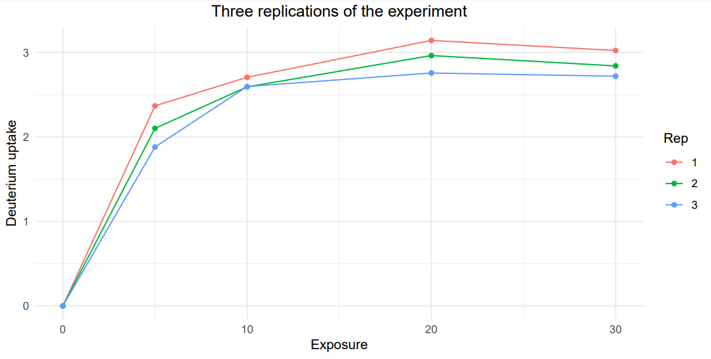

  
```{r setup, include=FALSE, message = FALSE}
knitr::opts_chunk$set(echo = FALSE)
```

# Introduction

This document summarizes functions of HaDeX2 web server by describing example data analysis.

```{r}

```

# Data upload

## Uploading structural data
